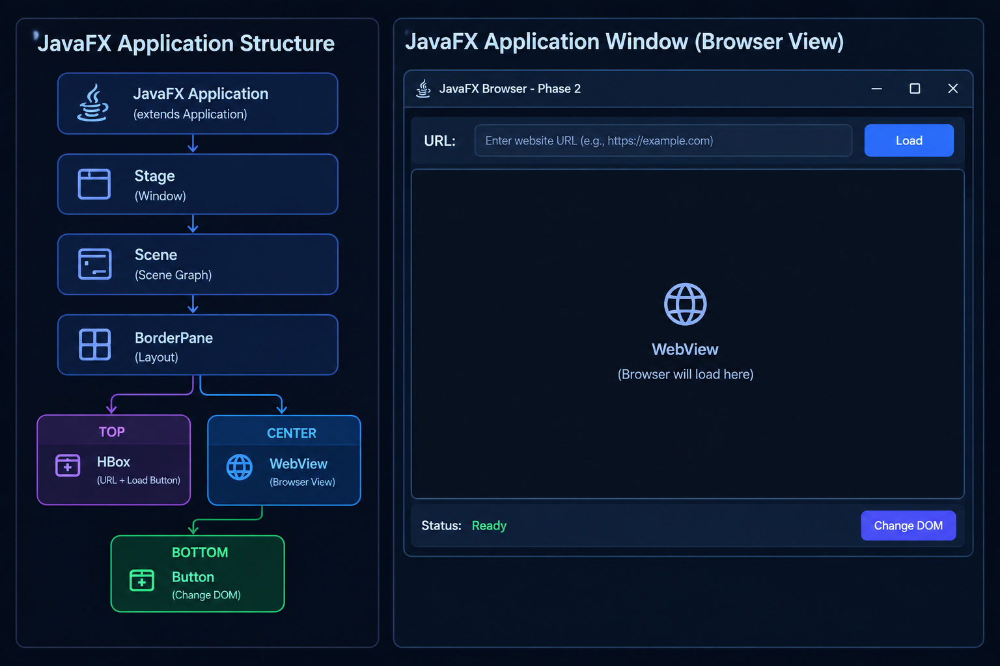

# Phase 2: Basic JavaFX Interface — Methodology

## Objective

The objective of Phase 2 was to create the basic user interface for the JavaFX browser application and organize its components using a suitable layout.

## Approach

We followed a step-by-step approach:

1. Created the main JavaFX application window using `Stage`.
2. Created a `Scene` to hold the application interface.
3. Used `BorderPane` as the main layout container.
4. Created a `WebView` to provide the browser area.
5. Created an `HBox` to arrange the buttons horizontally.
6. Added buttons for different DOM operations.
7. Placed the `WebView` in the center of the interface.
8. Placed the button bar at the bottom of the interface.
9. Connected button actions to JavaFX event handlers.
10. Tested the complete interface.

## UI Structure

```text
JavaFX Application
        ↓
      Stage
     (Window)
        ↓
      Scene
        ↓
    BorderPane
     /      \
   TOP     CENTER
    │         │
   HBox     WebView
    │
 URL + Load

   BOTTOM
      │
 Change DOM
